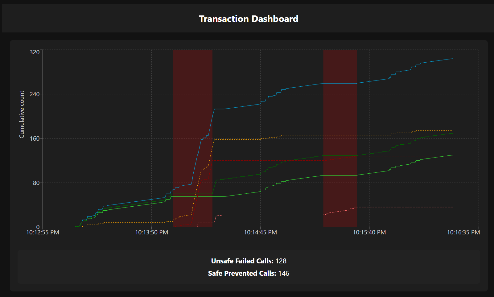
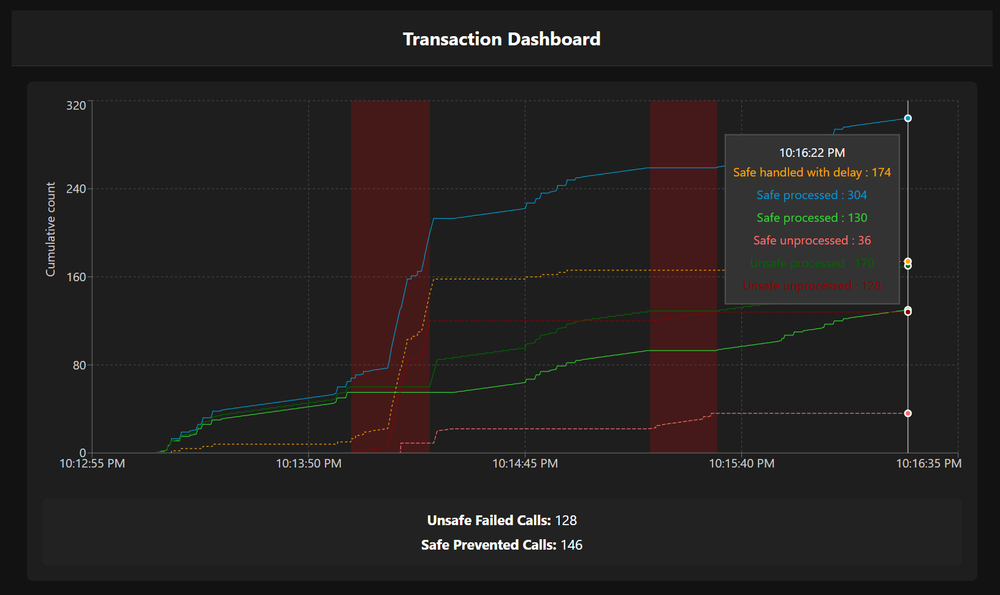

# Resilience4j Tutorial

## Opis projekta


Ovaj repozitorijum demonstrira primenu biblioteke **Resilience4j** u Spring Boot aplikaciji, sa ciljem da se prikaže kako se rešavaju problemi otpornosti mikroservisnih sistema na greške, prekide i nestabilnosti spoljašnjih servisa. Implementirani su sledeći mehanizmi otpornosti:

- **Circuit Breaker** — prekida lanac poziva ka eksternom servisu u slučaju učestalih grešaka
- **Bulkhead** — ograničava broj paralelnih zahteva kako bi se sprečilo preopterećenje
- **Rate Limiter** — ograničava broj zahteva u određenom vremenskom periodu
- **Retry** — automatski ponavlja neuspele zahteve

Implementiran je i dead letter queue (DLQ) mehanizam: svi neuspešni zahtevi se čuvaju u posebnom redu i automatski se ponovo obrađuju kada se sistem stabilizuje (tj. kada Circuit Breaker pređe u zatvoreno stanje). Uz backend aplikaciju, razvijen je i frontend interfejs za vizualizaciju rezultata i poređenje različitih pristupa obradi transakcija.

## Problem koji se rešava

U realnim sistemima, spoljašnji servisi često nisu dostupni ili se ponašaju nepredvidivo. Bez mehanizama za otpornost, neuspeh jednog servisa može dovesti do širenja problema kroz ceo sistem. **Resilience4j** omogućava implementaciju Circuit Breaker šablona, koji sprečava cascade failure i omogućava kontrolisano rukovanje greškama.

## Tehnologije

- **Backend:** Java 21, Spring Boot, Resilience4j, Maven
- **Frontend:** React, TypeScript, Vite, Recharts

## Struktura

- `demo-resilience4j`: Spring Boot aplikacija sa implementacijom Circuit Breaker, Bulkhead, Rate Limiter i Retry mehanizama, REST API za status transakcija.
- `demo-resilience4j-ui`: React aplikacija za vizualizaciju obrade transakcija i poređenje sa/bez otpornosti.

## Kako pokrenuti projekat
### Local

Za lokalno pokretanje projekta potrebno da imate instaliran NodeJS 20+ runtime, Java 21 JDK, Maven 3.9.11

**Backend**

1. Uđite u direktorijum `demo-resilience4j`.
2. Build-ujte aplikaciju:
	```
	mvn clean package -DskipTests
	```
3. Pokrenuti koristeći sistemski JRE
	```
	java -jar target/app.jar
	```
4. Aplikacija će biti dostupna na `http://localhost:8080`.

**Frontend**
1. Uđite u direktorijum `demo-resilience4j-ui`.
2. Instalirajte dependencies:
	```
	npm install
	```
3. Pokrenite aplikaciju:
	```
	npm run dev
	```
4. Interfejs će biti dostupan na `http://localhost:3000`.

### Docker

Za Docker pristup, najjednostavnije je koristiti aplikaciju Docker Desktop i prateći softver.
```
docker compose up --build
```
Interfejs dostupan na `http://localhost:3000`.


## Vizualizacija i testiranje

Frontend aplikacija prikazuje interaktivni grafikon koji omogućava poređenje obrade transakcija sa i bez otpornosti, kao i vizualizaciju perioda nedostupnosti eksternog servisa. Ispod grafikona se dodatno prikazuju ključne metrike:

- **Unsafe Failed Calls** — broj transakcija koje nisu obrađene u neotpornom režimu
- **Safe Prevented Calls** — broj poziva koje je Circuit Breaker sprečio dok je bio u OPEN/HALF_OPEN stanju

### Screenshot




### Legenda boja na grafikonu

 **Safe handled with delay** — Transakcije sa otpornim servisom koje su obrađene sa zakašnjenjem\
 **Safe processed** — Uspešno obrađene transakcije sa otpornim servisom\
 **Safe processed** — Brzo obrađene transakcije sa otpornim servisom\
 **Safe unprocessed** — Neobrađene transakcije sa otpornim servisom\
 **Unsafe processed** — Uspešno obrađene transakcije bez otpornosti\
 **Unsafe unprocessed** — Neobrađene transakcije bez otpornosti

Periodi nedostupnosti eksternog servisa su prikazani crvenim providnim trakama na grafikonu.

#### Backend API rute

- `/api/payment/status` — status obrađenih i neobrađenih transakcija sa otpornosti, uključuje i broj sprečenih poziva od strane Circuit Breaker-a
- `/api/payment/status/unsafe` — status bez otpornosti
- `/external-api/downtime` — informacije o downtime-u eksternog servisa

## Simulacija otkaza i opterećenja

U okviru projekta implementirane su dve vrste simulacija kako bi se testirali različiti aspekti otpornosti sistema:

### 1. Nepredvidiv Saobraćaj (Traffic Generator)

Klasa `PaymentSimulatorWorker` generiše zahteve ka sistemu u dva režima rada:

- **Normal Mode:** Stabilan tok saobraćaja, zahtevi se šalju na svakih 2000ms.
- **Burst Mode (Spike):** Nasumično se aktivira režim visokog opterećenja u trajanju od 5 sekundi, tada se zahtevi šalju na svakih 50ms.

Cilj ove simulacije je testiranje ponašanja Rate Limiter i Bulkhead mehanizama pod pritiskom i u uslovima naglog rasta saobraćaja.

### 2. Nestabilan Eksterni Servis (Fault Injection)

Eksterni API je programiran da simulira periodične ispade:

- **Frekvencija otkaza:** Servis "pada" nasumično na svakih 30 do 50 sekundi.
- **Trajanje otkaza:** Nedostupnost traje između 10 i 20 sekundi.

Cilj ove simulacije je testiranje Circuit Breaker i Retry mehanizama, kao i oporavka sistema putem Dead Letter Queue (DLQ).

## Tutorijal i dodatna objašnjenja

- Primer implementacije Circuit Breaker-a, Bulkhead-a, Rate Limiter-a i Retry-a nalazi se u klasi `PaymentService`.
- Poređenje sa nebezbednom implementacijom je u klasi `UnsafePaymentService`.
- Sve konfiguracije otpornosti su u `application.yaml`.
- Vizualizacija koristi React, TypeScript i biblioteku Recharts.
- Bezbedna obrada neuspešnih transakcija (retry) `PaymentDeadLetterHandler`

### Konfiguracija i objašnjenje Resilience4j podešavanja

```yaml
resilience4j:
  circuitbreaker:
    circuit-breaker-aspect-order: 1  # Redosled izvršavanja aspekta (manja vrednost = viši prioritet)
    instances:
      paymentCB:
        automaticTransitionFromOpenToHalfOpenEnabled: true  # Automatski prelazak iz OPEN u HALF_OPEN (potrebno zbog DQL-a)
        minimumNumberOfCalls: 3  # Minimalan broj poziva za evaluaciju stanja
        slidingWindowSize: 3  # Veličina prozora za praćenje uspešnosti
        failureRateThreshold: 100  # Threshold (%) za otvaranje prekidača
        waitDurationInOpenState: 10s  # Koliko dugo ostaje u OPEN stanju
        permittedNumberOfCallsInHalfOpenState: 3  # Koliko poziva je dozvoljeno u HALF_OPEN
  bulkhead:
    instances:
      paymentBulkhead:
        maxConcurrentCalls: 20  # Maksimalan broj paralelnih poziva
        maxWaitDuration: 0  # Koliko dugo se čeka oslobođen thread (0 = ne čeka se)
  retry:
    retry-aspect-order: 2  # Redosled izvršavanja retry aspekta
    instances:
      paymentRetry:
        maxAttempts: 2  # Koliko puta se pokušava ponovo
        waitDuration: 1s  # Pauza između pokušaja
  ratelimiter:
    instances:
      paymentRateLimiter:
        limitForPeriod: 5  # Maksimalan broj dozvoljenih poziva u periodu
        limitRefreshPeriod: 2s  # Period za resetovanje broja dozvoljenih poziva
        timeoutDuration: 1s  # Koliko dugo se čeka na dozvolu (ako je limit dostignut)
```

Ova podešavanja se nalaze u `application.yaml` i mogu se prilagoditi potrebama sistema.

## Zaključak

Ovaj projekat ilustruje značaj otpornosti u mikroservisnim arhitekturama i daje praktičan primer kako se Resilience4j može integrisati u Spring Boot aplikaciju, uz vizuelnu analizu efekata i jasno praćenje ključnih metrika.

> **Napomena:** Veoma je važno da se sva podešavanja Resilience4j mehanizama urade optimalno i u skladu sa realnim potrebama sistema. Neadekvatna ili previše restriktivna konfiguracija može dovesti do toga da servisi rade lošije nego bez ikakvih mehanizama otpornosti, uz veće kašnjenje, gubitak zahteva ili smanjenu propusnost sistema.
